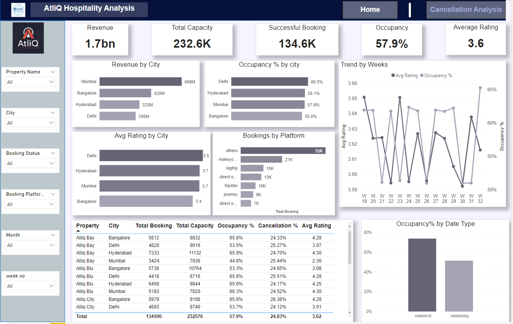
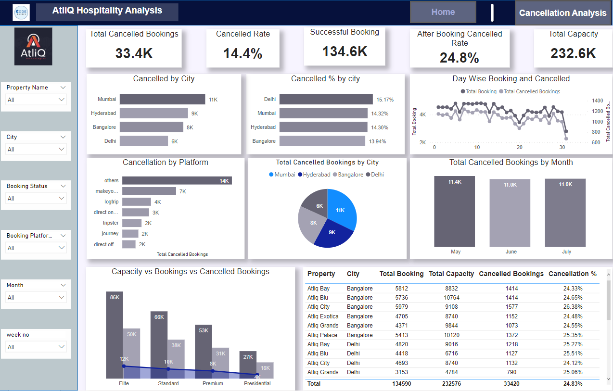

# AtliQ Hospitality Data Analysis for Revenue Team

**Problem Statement**

AtliQ Grands owns multiple five-star hotels across India. They have been in the hospitality industry for the past 20 years. Due to strategic moves from other competitors and ineffective decision-making in management, AtliQ Grands are losing its market share and revenue in the luxury/business hotels category. As a strategic move, the managing director of AtliQ Grands wanted to incorporate "Business and Data Intelligence" to regain their market share and revenue. However, they do not have an in-house data analytics team to provide them with these insights.

Their revenue management team had decided to hire a 3rd party service provider to provide them with insights from their historical data.

**Assumptions**

1. **Price Imbalance** : There is an imbalance in pricing.
2. **Possibly High Cancellation Rates** : The cancellation rates may be high.
3. **Consider Adjusting Hotel Room Categories** : It might be necessary to reduce or adjust the different classes of hotel rooms.
4. **Monthly, Vacation, or Weekend Occupancy Falls Short of Expectations** : The occupancy rates during the month, vacation season, and weekends may not be meeting our targets.
5. **Not All Cities Have the Same Privileges** : Not all cities offer the same privileges.

**Hypothesis**

1. Higher price lead to an increased rate of cancellations or not booking hotel result to revenue lose for AtiQ Grands.
2. Room classes may not be effectively meeting customer demands so Room Configuration needs to optimizations
3. Seasonal pricing rate needs to adjust where weekends vacations
4. Regional Disparities in Customer Expectation fulfil

**Research Question**

**Data Analysis and Finding:**

- The occupancy rate in Bangalore is lower compared to other cities.
- Bangalore receives lower average customer ratings or feedback.
- Delhi boasts a higher total hotel room capacity compared to other cities.
- Hyderabad experiences a higher rate of cancellations for Elite and Standard class room.

### Data Visualization insights

**Overall**

**Cancellation**

**Data Visulization Live Link**
[Live Visulazation](https://www.novypro.com/project/atliq-hospitality-data-analysis-for-revenue-team)

**Suggestion:**

- Prices should be adjusted based on the city, such as modifying hotel prices in Bangalore and Hyderabad.
- Total capacity should be adjusted according to demand. In this case, Delhi and Hyderabad have a total capacity higher than the demand.
- Offering discounts on bookings made during the last month can help reduce cancellations.
- Enhancements such as improving decorations, increasing facilities, and implementing marketing strategies can also be beneficial.